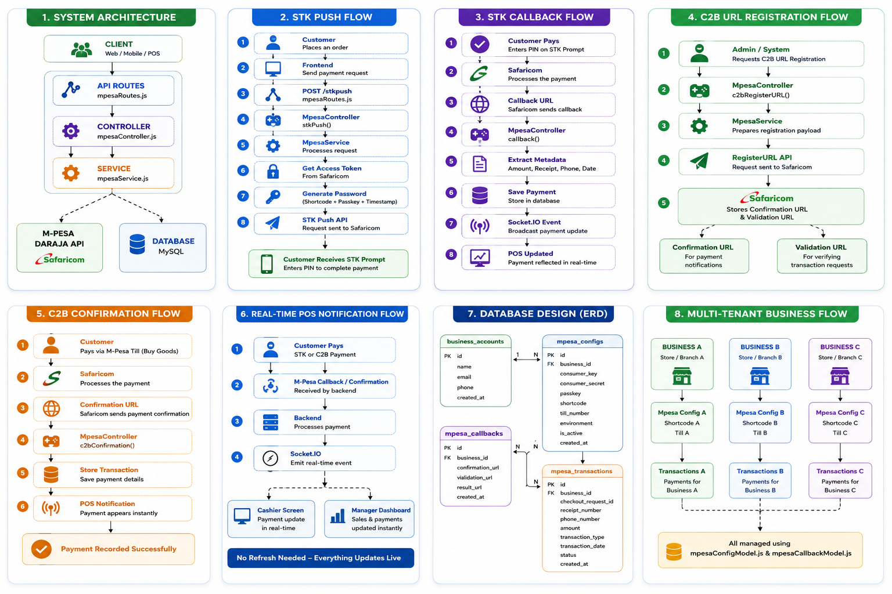
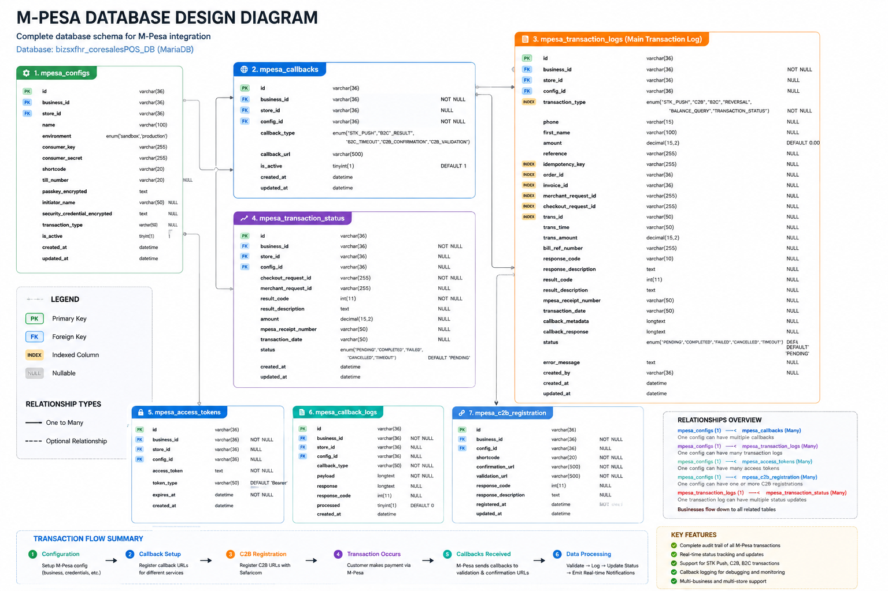
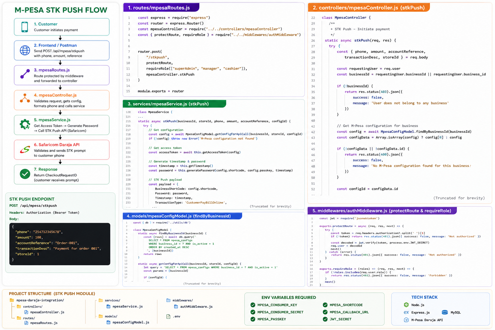
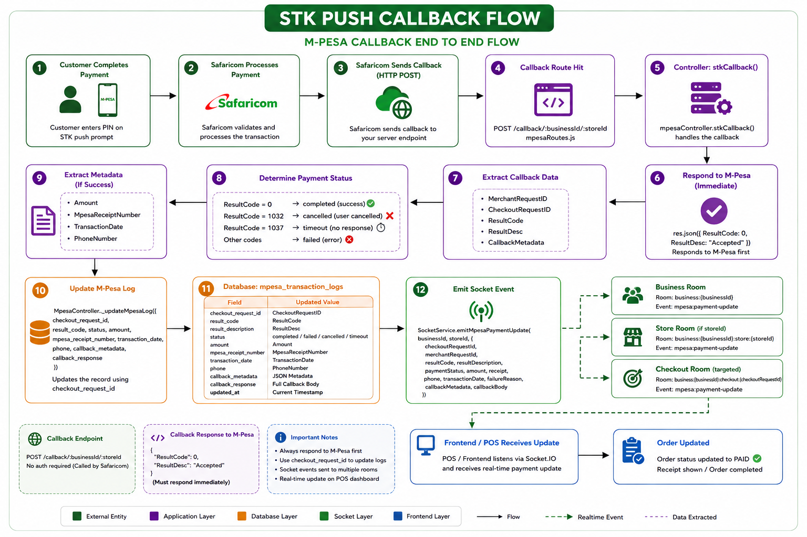
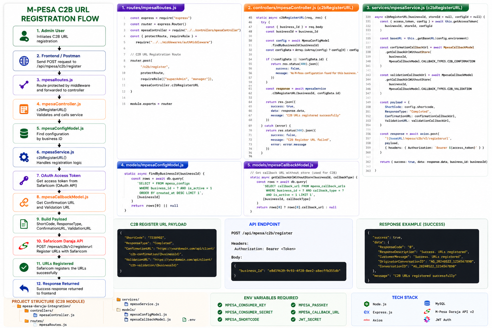
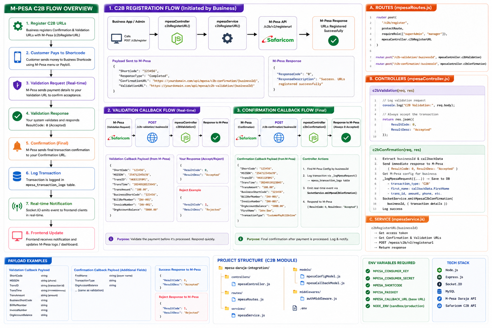
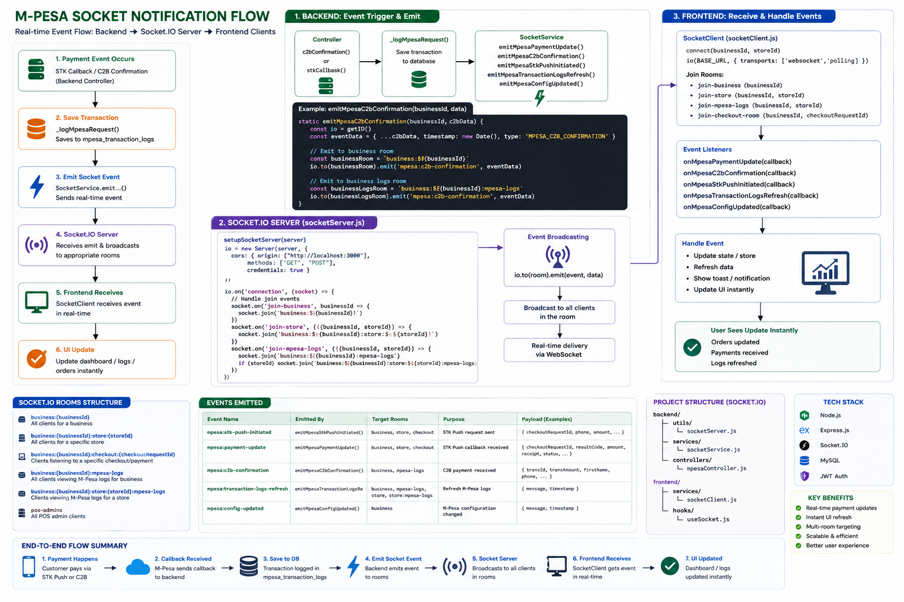

<div align="center">

# Multi-Tenant M-Pesa Integration

### Production-grade Daraja (M-Pesa) engine for multi-tenant SaaS POS / ERP platforms


<p>
  
  
  
  
  
</p>

<p>
  
  
  
</p>

</div>

<br/>

> **What this is:** a drop-in M-Pesa (Daraja) module that lets a single SaaS codebase serve *many* independent businesses — each with its own consumer key/secret, passkey, shortcode, till number and callback URLs — while sharing one database, one API, and one real-time layer.

<br/>

## Repository Map

```text
MPESA_DARAJA_INTERGRATION
├── docs/
│   └── images/
│       ├── 01-system-architecture.png
│       ├── 02-stk-push-flow.png
│       ├── 03-stk-callback-flow.png
│       ├── 04-c2b-registration-flow.png
│       ├── 05-c2b-confirmation-flow.png
│       ├── 06-realtime-pos-notification-flow.png
│       ├── 07-database-design.png
│       └── 08-multi-tenant-business-flow.png
├── src/
│   ├── client/
│   │   ├── hooks/useSocket.js
│   │   └── services/socketClient.js
│   ├── controllers/mpesaController.js
│   ├── middlewares/
│   ├── models/
│   │   ├── mpesaCallbackModel.js
│   │   └── mpesaConfigModel.js
│   ├── routes/mpesaRoutes.js
│   ├── services/
│   │   ├── encryptionService.js
│   │   ├── mpesaService.js
│   │   └── socketService.js
│   └── utils/socketServer.js
├── LICENSE
└── README.md
```

<br/>

## Table of Contents

| | | |
|---|---|---|
| [1. Overview](#-overview) | [6. STK Push Flow](#-stk-push-flow) | [11. Real-Time POS Notifications](#-real-time-pos-notifications) |
| [2. System Architecture](#%EF%B8%8F-system-architecture) | [7. STK Callback Processing](#-stk-callback-processing) | [12. Security Architecture](#-security-architecture) |
| [3. Multi-Tenant Design](#-multi-tenant-business-flow) | [8. C2B Registration](#-c2b-registration) | [13. Related Models](#-related-models) |
| [4. Database Design](#%EF%B8%8F-database-design) | [9. C2B Confirmation](#-c2b-confirmation-processing) | [14. Database Schema](#-database-schema) |
| [5. Config Management](#%EF%B8%8F-mpesa-configuration-management) | [10. Transaction Logging](#-transaction-logging) | [15. Roadmap](#-roadmap--future-improvements) |

<br/>

---

## 🔎 Overview

This module lets **one SaaS platform** serve **many businesses (tenants)** simultaneously, where every tenant plugs in its own M-Pesa credentials without ever touching another tenant's data or money flow.

Each business supplies:

| Credential | Purpose |
|---|---|
| Consumer Key / Secret | Daraja OAuth authentication |
| Passkey | STK Push password generation |
| Shortcode / Till Number | Where the money lands |
| Callback URLs | Where Safaricom sends results |

Every request in the system is scoped by three identifiers that travel together through the entire call stack:

```js
businessId   // WHO is this payment for?
storeId      // WHICH branch/outlet initiated it?
configId     // WHICH credential set should be used?
```

This trio is the backbone of tenant isolation — see [Multi-Tenant Business Flow](#-multi-tenant-business-flow) below.

<br/>

---

## System Architecture

> The platform sits between the POS frontend and Safaricom's Daraja API, orchestrating auth, payments, persistence and real-time delivery back to the till. Requests flow **POS → Controller → Service → Daraja**, while callbacks flow the other way: **Daraja → Callback Route → Database → Socket.IO → POS**, so a cashier sees a payment land without ever refreshing the screen.

<table>
<tr>
<td width="45%" valign="top" align="center">



<sub> High-level component diagram</sub>

</td>
<td width="55%" valign="top">

```text
┌─────────────┐       ┌──────────────┐
│ POS Frontend│─────▶│  Controller   │
│ (React/     │       │ mpesaController│
│  Socket.IO) │       └──────┬───────┘
└─────▲───────┘              │
      │                      ▼
      │              ┌──────────────┐
      │              │   Service    │
      │              │ mpesaService │
      │              └──────┬───────┘
      │                     ▼
      │              ┌──────────────┐
      │              │ Safaricom    │
      │              │ Daraja API   │
      │              └──────┬───────┘
      │                     │ callback
      │              ┌──────▼───────┐
      │              │  Database    │
      │              │ (3 tables)   │
      │              └──────┬───────┘
      │                     ▼
      │              ┌──────────────┐
      └──────────────│ Socket.IO    │
                     │ SocketService│
                     └──────────────┘
```

</td>
</tr>
</table>

<br/>

---

## Multi-Tenant Business Flow

> Every single controller method begins the same way — it resolves **who** is calling. The `businessId` extracted from the authenticated user is the tenant key that scopes credentials, callback URLs, and transaction logs for the rest of the request lifecycle.

<table>
<tr>
<td width="45%" valign="top" align="center">


<sub>One platform → many isolated businesses</sub>

</td>
<td width="55%" valign="top">

```js
// mpesaController.js
// STEP 1 — Identify the tenant making the request.
// Every downstream call (config lookup, STK push,
// logging, sockets) is scoped to this businessId so
// tenants never see or touch each other's data.
const requestingUser = req.user
const businessId =
    requestingUser.businessId ||
    requestingUser.business_id

if (!businessId) {
    return res.status(403).json({
        success: false,
        message: 'User does not belong to any business'
    })
}

// STEP 2 — Load THIS tenant's own M-Pesa credentials.
// Two businesses can run the exact same code path
// and still hit two completely different Daraja
// shortcodes, because the config is resolved per
// businessId (and optionally per storeId).
const config =
    await MpesaConfigModel.findByBusinessId(businessId)
```

**Tenant isolation guarantees:**
- Separate credentials per business
- Separate callback URLs per business/store
- Separate transaction logs per business
- Separate Socket.IO rooms (`business:{id}`)

</td>
</tr>
</table>

<br/>

---

## Database Design

> Three tables carry the entire integration: one stores encrypted tenant credentials, one stores per-tenant callback routing, and one is the immutable audit trail of every payment attempt and result — see the full [schema](#-database-schema) further down.

<table>
<tr>
<td width="45%" valign="top" align="center">



<sub> Entity relationship overview</sub>

</td>
<td width="55%" valign="top">

```text
business_mpesa_configs
 └── 1 business → many configs (per store)
      • encrypted consumer_key / consumer_secret
      • encrypted passkey / security_credential
      • shortcode, till_number, environment

business_mpesa_callbacks
 └── 1 business → many callback URLs
      • per callback_type (stk_push, c2b_validation, ...)
      • per store override, else business default

mpesa_transaction_logs
 └── 1 business → many transactions
      • STK_PUSH + C2B rows
      • joins to invoices for reconciliation
```

```js
// Relationship keys shared across all 3 tables
business_id   // tenant
store_id      // branch (nullable = business-level)
config_id     // which credential set was used
```

</td>
</tr>
</table>

<br/>

---

## M-Pesa Configuration Management

> `MpesaConfigModel` is the credential vault. It never stores a secret in plain text — `consumer_secret`, `passkey`, and `security_credential` are AES‑256‑GCM encrypted on write and only decrypted in-memory, milliseconds before an outbound Daraja call is made.

<table>
<tr>
<td width="45%" valign="top" align="center">


<sub> Credentials in, ciphertext at rest</sub>

</td>
<td width="55%" valign="top">

```js
// models/mpesaConfigModel.js
// Encrypt every secret BEFORE it touches the database.
// Plaintext credentials never reach disk.
static async create(data) {
    const encryptedData = {
        id: data.id || DatabaseManager.generateId(),
        business_id: data.business_id,      // tenant scope
        store_id: data.store_id || null,     // branch scope
        consumer_key:
            encryptionService.encrypt(data.consumer_key),
        consumer_secret:
            encryptionService.encrypt(data.consumer_secret),
        passkey:
            encryptionService.encrypt(data.passkey),
        security_credential:
            encryptionService.encrypt(data.security_credential),
        shortcode: data.shortcode,
        environment: data.environment || 'production',
        is_default: data.is_default || 0,
    }

    await db.query(
        `INSERT INTO business_mpesa_configs SET ?`,
        [encryptedData]
    )
    return this.findById(id)
}
```

```js
// Resolution order when a payment is initiated:
// configId ➜ store default ➜ business default
static async getConfigForApiCall(businessId, storeId, configId) {
    // decrypts on the way OUT, only when needed
    return {
        ...configData,
        consumer_key: encryptionService.decrypt(configData.consumer_key),
        consumer_secret: encryptionService.decrypt(configData.consumer_secret),
        passkey: encryptionService.decrypt(configData.passkey)
    }
}
```

</td>
</tr>
</table>

<br/>

---

## STK Push Flow

> The customer-facing "Enter M‑Pesa PIN" prompt. The controller validates and normalizes the phone number, loads the tenant's config, and delegates to `mpesaService.stkPush`, which builds the Daraja password, fires the request, and logs a `PENDING` transaction row that the callback will later close out.

<table>
<tr>
<td width="45%" valign="top" align="center">



<sub>📱 Push a prompt to the customer's phone</sub>

</td>
<td width="55%" valign="top">

```js
// controllers/mpesaController.js
// Normalize any Kenyan phone format into 254XXXXXXXXX
// before it is ever sent to Daraja.
let formattedPhone = phone.replace(/\s+/g, '')
if (formattedPhone.startsWith('0')) {
    formattedPhone = '254' + formattedPhone.substring(1)
}
if (formattedPhone.startsWith('+')) {
    formattedPhone = formattedPhone.substring(1)
}
if (!formattedPhone.startsWith('254')) {
    formattedPhone = '254' + formattedPhone
}
```

```js
// services/mpesaService.js
// Resolve tenant credentials → build Daraja password
// → call Safaricom → return CheckoutRequestID.
async stkPush(businessId, storeId, phone, amount, reference, configId) {
    const { access_token, config } =
        await this.getAccessToken(businessId, storeId, configId)

    const passkey = encryptionService.decrypt(config.passkey)
    const { password, timestamp } =
        this.generatePassword(config.shortcode, passkey)

    const callbackUrl = await MpesaCallbackModel.getCallbackUrl(
        businessId, storeId,
        MpesaCallbackModel.CALLBACK_TYPES.STK_PUSH
    )

    const payload = {
        BusinessShortCode: config.shortcode,
        Password: password,
        Timestamp: timestamp,
        TransactionType: config.transaction_type,
        Amount: amount,
        PartyA: phone,
        PartyB: config.till_number,
        PhoneNumber: phone,
        CallBackURL: callbackUrl,
        AccountReference: reference,
    }

    return axios.post(`${baseURL}/mpesa/stkpush/v1/processrequest`,
        payload, { headers: { Authorization: `Bearer ${access_token}` } })
}
```

```js
// Every request is logged as PENDING immediately,
// so nothing is ever lost even if the callback fails.
await MpesaController._logMpesaRequest({
    business_id: businessId,
    transaction_type: 'STK_PUSH',
    phone: formattedPhone,
    amount,
    status: response.data?.ResponseCode === '0'
        ? 'PENDING' : 'FAILED'
})
```

</td>
</tr>
</table>

<br/>

---

## STK Callback Processing

> Safaricom calls back asynchronously — often seconds after the initial request — with the customer's decision. Daraja requires an **immediate** `200 OK`, so the controller responds first, then processes the payload, maps Safaricom's numeric `ResultCode` to a human status, updates the log row, and fans the result out over sockets.

<table>
<tr>
<td width="45%" valign="top" align="center">



<sub> Safaricom tells us what happened</sub>

</td>
<td width="55%" valign="top">

```js
// controllers/mpesaController.js
// Daraja will retry if it doesn't get a fast 200 —
// acknowledge FIRST, process AFTER.
static async stkCallback(req, res) {
    res.json({ ResultCode: 0, ResultDesc: "Accepted" })

    const { stkCallback } = req.body.Body
    const {
        MerchantRequestID, CheckoutRequestID,
        ResultCode, ResultDesc, CallbackMetadata
    } = stkCallback

    // Translate Safaricom's numeric codes into
    // states the rest of the app understands.
    let paymentStatus
    switch (ResultCode) {
        case 0: paymentStatus = 'completed'; break
        case 1032: paymentStatus = 'cancelled'; break   // user cancelled
        case 1037: paymentStatus = 'timeout'; break      // no response
        default: paymentStatus = 'failed'
    }
```

```js
    // Pull Amount / Receipt / Phone out of Daraja's
    // key-value CallbackMetadata array.
    const getValue = (name) =>
        CallbackMetadata?.Item.find(i => i.Name === name)?.Value

    const amount  = getValue("Amount")
    const receipt = getValue("MpesaReceiptNumber")
    const phone   = getValue("PhoneNumber")

    await MpesaController._updateMpesaLog({
        checkout_request_id: CheckoutRequestID,
        result_code: ResultCode,
        status: paymentStatus,
        amount, mpesa_receipt_number: receipt, phone
    })

    // Push the result live to the till that's waiting.
    SocketService.emitMpesaPaymentUpdate(businessId, storeId, {
        checkoutRequestId: CheckoutRequestID,
        paymentStatus, amount, receipt, phone
    })
}
```

</td>
</tr>
</table>

<br/>

---

## C2B Registration

> Before Safaricom will forward Pay‑Bill/Buy‑Goods deposits to your app, it needs to be told **where** to send them. This one-time (per tenant) call registers the tenant's Validation and Confirmation URLs against their shortcode.

<table>
<tr>
<td width="45%" valign="top" align="center">



<sub> Telling Safaricom where to call back</sub>

</td>
<td width="55%" valign="top">

```js
// controllers/mpesaController.js
static async c2bRegisterURL(req, res) {
    const { business_Id: businessId } = req.body
    const config = await MpesaConfigModel.findByBusinessId(businessId)

    const response = await mpesaService.c2bRegisterURL(
        businessId, config[0].id
    )

    return res.json({
        success: true,
        data: response.data,
        message: "C2B URLs registered successfully"
    })
}
```

```js
// services/mpesaService.js
// Register per-tenant Validation & Confirmation URLs
// with Safaricom, so C2B deposits know where to land.
async c2bRegisterURL(businessId, storeId, configId) {
    const { access_token, config } =
        await this.getAccessToken(businessId, storeId, configId)

    const confirmationCallbackUrl =
        await MpesaCallbackModel.getCallbackUrlWithoutStore(
            businessId,
            MpesaCallbackModel.CALLBACK_TYPES.C2B_CONFIRMATION
        )
    const validationCallbackUrl =
        await MpesaCallbackModel.getCallbackUrlWithoutStore(
            businessId,
            MpesaCallbackModel.CALLBACK_TYPES.C2B_VALIDATION
        )

    return axios.post(`${baseURL}/mpesa/c2b/v2/registerurl`, {
        ShortCode: config.shortcode,
        ResponseType: "Completed",
        ConfirmationURL: confirmationCallbackUrl,
        ValidationURL: validationCallbackUrl,
    }, { headers: { Authorization: `Bearer ${access_token}` } })
}
```

</td>
</tr>
</table>

<br/>

---

## C2B Confirmation Processing

> Whenever a customer deposits directly via Pay‑Bill/Till (outside the app's STK flow), Safaricom posts the completed transaction here. The controller persists it as a `C2B` row and broadcasts it live — this is how "walk-in" M-Pesa payments still show up on the POS in real time.

<table>
<tr>
<td width="45%" valign="top" align="center">



<sub> A deposit lands — now what?</sub>

</td>
<td width="55%" valign="top">

```js
// controllers/mpesaController.js
static async c2bConfirmation(req, res) {
    const callbackData = req.body
    const { businessId } = req.params

    // Acknowledge immediately, exactly like STK callback.
    res.json({ ResultCode: 0, ResultDesc: "Accepted" })

    const config = await MpesaConfigModel.findByBusinessId(businessId)

    // Persist a permanent, tenant-scoped payment record.
    await MpesaController._logMpesaRequest({
        business_id: businessId,
        config_id: config?.[0]?.id || null,
        transaction_type: 'C2B',
        phone: callbackData.MSISDN,
        first_name: callbackData.FirstName,
        amount: callbackData.TransAmount,
        trans_id: callbackData.TransID,
        bill_ref_number: callbackData.BillRefNumber,
        mpesa_receipt_number: callbackData.TransID,
        status: 'COMPLETED',
        callback_response: callbackData
    })

    // Notify every connected till for this business instantly.
    SocketService.emitMpesaC2bConfirmation(businessId, {
        transId: callbackData.TransID,
        transAmount: callbackData.TransAmount,
        phone: callbackData.MSISDN,
        firstName: callbackData.FirstName,
        billRefNumber: callbackData.BillRefNumber
    })
}
```

</td>
</tr>
</table>

<br/>

---

## Transaction Logging

> `mpesa_transaction_logs` is the single source of truth for every payment attempt — STK requests, STK results, C2B deposits, failures and timeouts all funnel through the same audit trail, de-duplicated by receipt number, `trans_id`, or checkout request ID so retried callbacks never create phantom rows.

<table>
<tr>
<td width="45%" valign="top" align="center">


<sub> One row per payment, start to finish</sub>

</td>
<td width="55%" valign="top">

```js
// controllers/mpesaController.js
// Upserts a log row: if a matching receipt/trans_id
// already exists, UPDATE it (callback arrived); else
// INSERT a fresh PENDING row (initial STK request).
static async _logMpesaRequest(data) {
    let existingLog = null

    if (data.mpesa_receipt_number) {
        const existing = await db.query(
            `SELECT id FROM mpesa_transaction_logs
             WHERE mpesa_receipt_number = ? AND business_id = ?
             ORDER BY created_at DESC LIMIT 1`,
            [data.mpesa_receipt_number, data.business_id]
        )
        existingLog = existing[0] || null
    }

    if (existingLog) {
        // merge in new fields (status, trans_id, callback payload...)
        await db.query(
            `UPDATE mpesa_transaction_logs SET ... WHERE id = ?`,
            [...values, existingLog.id]
        )
    } else {
        await db.query(
            `INSERT INTO mpesa_transaction_logs SET ?`, [{
                id: DatabaseManager.generateId(),
                business_id: data.business_id,
                transaction_type: data.transaction_type,
                status: data.status || 'PENDING',
                ...
            }]
        )
    }
}
```

**Lifecycle states:** `PENDING → COMPLETED` &nbsp;|&nbsp; `PENDING → FAILED` &nbsp;|&nbsp; `PENDING → CANCELLED` &nbsp;|&nbsp; `PENDING → TIMEOUT`

</td>
</tr>
</table>

<br/>

---

## Real-Time POS Notifications

> Socket.IO closes the loop: the moment a callback or C2B confirmation is processed, `SocketService` broadcasts into per-business, per-store and per-checkout rooms so **every** connected till updates instantly — no polling, no manual refresh.

<table>
<tr>
<td width="45%" valign="top" align="center">



<sub> Payment confirmed → screen updates instantly</sub>

</td>
<td width="55%" valign="top">

```js
// services/socketService.js
// Broadcast to three overlapping scopes so any screen
// watching this business, this store, or this specific
// checkout request receives the update.
static emitMpesaPaymentUpdate(businessId, storeId, paymentData) {
    const io = getIO()
    const eventData = { ...paymentData, type: 'MPESA_PAYMENT_UPDATE' }

    io.to(`business:${businessId}`).emit('mpesa:payment-update', eventData)

    if (storeId) {
        io.to(`business:${businessId}:store:${storeId}`)
          .emit('mpesa:payment-update', eventData)
    }
    if (paymentData.checkoutRequestId) {
        io.to(`business:${businessId}:checkout:${paymentData.checkoutRequestId}`)
          .emit('mpesa:payment-update', eventData)
    }
}
```

```js
// client/hooks/useSocket.js
// Frontend listener — toasts the cashier the moment
// the payment resolves, no page refresh needed.
const unsubscribe = socket.onMpesaPaymentUpdate((data) => {
    if (data.paymentStatus === 'completed') {
        toast.success(`Payment of KES ${data.amount} received!`, {
            description: `Receipt: ${data.receipt}`
        })
    } else if (data.paymentStatus === 'failed') {
        toast.error(`Payment failed: ${data.failureReason}`)
    }
    onPaymentUpdate(data)
})
```

```text
Customer pays  →  Daraja callback  →  DB updated
      →  Socket event emitted  →  POS toast fires 🎉
```

</td>
</tr>
</table>

<br/>

---

## Security Architecture

> Nothing that could compromise a tenant's M-Pesa account is ever persisted or transmitted in plain text. Secrets are encrypted at rest with AES‑256‑GCM (unique IV + auth tag per value), masked in every API response, and only decrypted in-memory for the split second an outbound Daraja call needs them.

<table>
<tr>
<td width="45%" valign="top" align="center">


<sub> Encrypt at rest, mask on response</sub>

</td>
<td width="55%" valign="top">

```js
// services/encryptionService.js
// AES-256-GCM: unique IV per value + auth tag
// guards against tampering, not just disclosure.
encrypt(plainText) {
    const iv = crypto.randomBytes(this.ivLength)
    const cipher = crypto.createCipheriv(
        this.algorithm, this.masterKey, iv
    )
    let encrypted = cipher.update(plainText, 'utf8', 'base64')
    encrypted += cipher.final('base64')
    const authTag = cipher.getAuthTag()

    return `${iv.toString('base64')}:${authTag.toString('base64')}:${encrypted}`
}
```

```js
// Responses NEVER leak raw secrets — only a masked
// preview, e.g. "sk_l****_z93k", is ever sent to a client.
static getConfigForResponse(config) {
    return {
        ...config,
        consumer_secret: encryptionService.maskSensitive(config.consumer_secret),
        passkey: encryptionService.maskSensitive(config.passkey),
        security_credential: encryptionService.maskSensitive(config.security_credential),
        webhook_secret: encryptionService.maskSensitive(config.webhook_secret)
    }
}
```

</td>
</tr>
</table>

<br/>

---

## Related Models

<details open>
<summary><b> OrderModel — linking payments to real orders</b></summary>

<br/>

`OrderModel` is imported into the controller so a completed M‑Pesa payment can be tied back to the exact order/invoice that triggered it — this is what turns a raw Daraja callback into "Order #482 is now paid."

```js
// controllers/mpesaController.js
// -----------------------------------------------------------------
// MULTI-TENANT NOTE: OrderModel is always queried scoped to the
// same businessId that owns the M-Pesa config used for the STK
// push. This prevents Business A's callback from ever being able
// to mark Business B's order as paid, even if two tenants somehow
// generated colliding reference numbers.
// -----------------------------------------------------------------
const OrderModel = require('../models/orderModel')

// Typical post-callback workflow (tenant-scoped throughout):
// 1. Create Order              -> orders.business_id = businessId
// 2. Initiate STK Push         -> mpesa_transaction_logs.business_id = businessId
// 3. Wait for Callback         -> matched by checkout_request_id
// 4. OrderModel.markAsPaid()   -> WHERE id = orderId AND business_id = businessId
// 5. Emit socket + print receipt for that tenant's till only
```

</details>

<details>
<summary><b>🗝️ MpesaConfigModel — the tenant credential vault</b></summary>

<br/>

```js
// models/mpesaConfigModel.js
// -----------------------------------------------------------------
// MULTI-TENANT NOTE: every lookup method (findByBusinessId,
// findByBusinessAndStore, findDefaultByBusinessId) filters by
// business_id first. Store-level configs fall back to the
// business-level default, but NEVER fall back across businesses.
// -----------------------------------------------------------------
class MpesaConfigModel {
    // Resolution order: exact config_id > store default > business default
    static async getConfigForApiCall(businessId, storeId, configId) { /* ... */ }
}
```

</details>

<details>
<summary><b> MpesaCallbackModel — per-tenant callback routing</b></summary>

<br/>

```js
// models/mpesaCallbackModel.js
// -----------------------------------------------------------------
// MULTI-TENANT NOTE: callback URLs are resolved per business_id
// (and optionally store_id) so Safaricom can be told a DIFFERENT
// webhook per tenant, even though they all hit the same codebase.
// Falls back to an auto-generated URL when no custom one is set:
//   {MPESA_CALLBACK_URL}/api/client/mpesa/callback/{businessId}/{storeId}
// -----------------------------------------------------------------
class MpesaCallbackModel {
    static CALLBACK_TYPES = {
        STK_PUSH: 'stk_push',
        C2B_VALIDATION: 'c2b_validation',
        C2B_CONFIRMATION: 'c2b_confirmation',
        // ...
    }
}
```

</details>

<details>
<summary><b> SocketService & socketServer — tenant-scoped real-time rooms</b></summary>

<br/>

```js
// utils/socketServer.js
// -----------------------------------------------------------------
// MULTI-TENANT NOTE: clients explicitly "join" a business room
// (join-business) and optionally a store room (join-store). All
// M-Pesa events are emitted ONLY into these scoped rooms, so a
// browser tab open for Business A physically cannot receive
// Business B's payment events.
// -----------------------------------------------------------------
socket.on('join-business', (businessId) => {
    socket.join(`business:${businessId}`)
})
```

</details>

<br/>

---

## Database Schema

###  `business_mpesa_configs`

| Column | Type | Notes |
|---|---|---|
| `id` | varchar(pk) | |
| `business_id` | varchar | tenant key |
| `store_id` | varchar, nullable | branch override |
| `consumer_key` / `consumer_secret` | text | encrypted |
| `passkey` | text |  encrypted |
| `security_credential` | text | encrypted |
| `shortcode` / `till_number` | varchar | |
| `transaction_type` | varchar | default `CustomerBuyGoodsOnline` |
| `initiator_name` | varchar | for B2C/Reversal/etc. |
| `webhook_secret` | varchar | encrypted |
| `environment` | enum | `sandbox` / `production` |
| `is_active` / `is_default` | boolean | |
| `sync_status`, `sync_version`, `last_synced` | — | offline-first sync support |

###  `business_mpesa_callbacks`

| Column | Type | Notes |
|---|---|---|
| `id` | varchar(pk) | |
| `business_id` / `store_id` | varchar | tenant + branch scope |
| `mpesa_config_id` | varchar, FK | |
| `callback_type` | enum | `stk_push`, `c2b_validation`, `c2b_confirmation`, `b2c_result`, ... |
| `callback_url` | varchar | |
| `is_active` / `is_default` | boolean | |

###  `mpesa_transaction_logs`

| Column | Type | Notes |
|---|---|---|
| `id` | varchar(pk) | |
| `business_id` / `store_id` / `config_id` | varchar | tenant scope |
| `transaction_type` | enum | `STK_PUSH`, `C2B` |
| `phone`, `first_name`, `amount` | — | |
| `merchant_request_id`, `checkout_request_id` | varchar | STK correlation |
| `trans_id`, `trans_time`, `trans_amount`, `bill_ref_number` | — | C2B fields |
| `response_code`, `response_description` | — | Daraja request-time result |
| `result_code`, `result_description` | — | Daraja callback result |
| `mpesa_receipt_number` | varchar | dedup key |
| `callback_metadata` / `callback_response` | json | raw payloads, for audits |
| `status` | enum | `PENDING`, `COMPLETED`, `FAILED`, `CANCELLED`, `TIMEOUT` |
| `order_id`, `invoice_id` | varchar, nullable | links to `OrderModel` |
| `created_by` | varchar | user who initiated (STK) |

<br/>
---

<div align="center">

### Built for ERP · POS · Restaurant & Enterprise SaaS platforms


</div>
